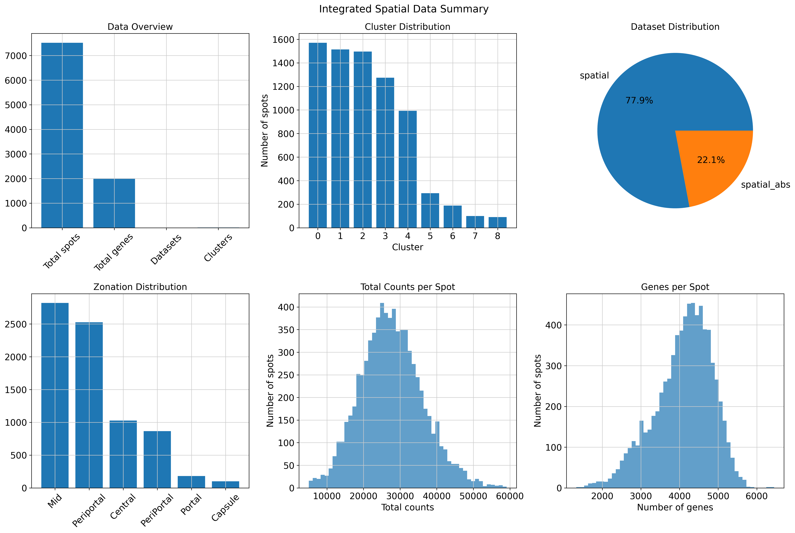

# 🧬 Visium Spatial Transcriptomics Data Integration Pipeline

[](https://www.python.org/downloads/)
[](https://opensource.org/licenses/MIT)
[](https://www.10xgenomics.com/products/spatial-gene-expression)

A complete end-to-end pipeline for processing and integrating **Visium spatial transcriptomics data**. This pipeline handles multi-modal data (RNA + Protein), performs data integration, and generates ready visualizations.

## Description of the Dataset used in this pipeline


### **1. Prepare Input Data**

**⚠️ IMPORTANT**: The raw data files are too large for GitHub. You need to download them separately.

#### **Download the Demo Dataset from Charlotte Scott and Martin Guilliams's Lab** . 

**🧬 [Here is the link](https://livercellatlas.org/download.php)** to download the dataset manually.

The pipeline was designed and tested with mouse liver spatial transcriptomics data:

#### Standard Visium Data

- Source: 10X Visum From Charlotte
- Format: 10X Cell Ranger output (matrix.mtx.gz, barcodes.tsv.gz, features.tsv.gz)
- Sample info: Contains 5 biological samples (JBO1-JBO4, CAP02)
- Annotations: Includes liver zonation information (Periportal, Central, Mid, Portal)
- 
#### Visium + Antibodies Data

- Source: Multi-modal Visium dataset from Charlotte
- Format: H5 file + ADT CSV
- Features: ~80 protein markers alongside RNA
- Spatial info: Same tissue with protein quantification

### **Example Data Download Script**

Run  this script to download demo data used in this repo:

```bash
./download_demo_data.sh
```


#### **Required Files**

You need to obtain these files (see **Data Sources** section below):

```
Data/
├── Visium_Spatial/
│   ├── annot_mouseStStVisium.csv                    # Spot annotations
│   └── rawData_mouseStStVisium/
│       └── countTable_mouseStStVisium/
│           ├── barcodes.tsv.gz                      # 10X barcodes
│           ├── features.tsv.gz                      # 10X features  
│           └── matrix.mtx.gz                        # 10X count matrix
└── Visium_spatial_with_ABs/
    ├── annot_mouseStStWithABsVisium.csv            # Antibody data annotations
    └── rawData_mouseStStWithABsVisium/
        ├── countTable_ADT_mouseStStVisiumWithABs.csv    # ADT counts
        └── countTable_mouseStStVisiumWithABs.h5         # H5 format data
```


## Example Results & Visualizations

The pipeline generates comprehensive visualizations that showcase both technical quality and biological insights. Below are example outputs demonstrating the pipeline's capabilities:

### ** Spatial Data Integration Summary**

<div align="center">
  
  <br><i>Integrated Data summuary ( RNA+ Protein) </i>
</div>


### ** Spatial Organization Patterns**

<div align="center">
  
  <br><i>Spatial UMAP embeddings revealing liver zonation patterns across multiple samples and biological annotations</i>
</div>

**Biological discoveries:**
- **Zonation Gradient**: Clear spatial organization from Periportal (blue) → Mid (green) → Central (red) regions
- **Cross-sample Consistency**: Zonation patterns preserved across different biological samples  
- **Metabolic Organization**: Spatial arrangement reflects liver metabolic functions
- **Sample Integration**: Multiple samples show consistent spatial biology

### **🔗 Multi-Modal Integration Results**

<div align="center">
  
  <br><i>Comprehensive integration assessment showing successful batch correction and dataset harmonization</i>
</div>

**Integration achievements:**
- **Top Row**: Before/after integration comparison demonstrates effective batch correction
- **Dataset Mixing**: Successful integration of standard Visium + antibody datasets
- **Spatial Preservation**: Zonation patterns maintained during integration process
- **Technical Success**: Batch effects removed while preserving biological variation

### ** Detailed Clustering & Cell Type Identification**

<div align="center">
  
  <br><i>High-resolution clustering results revealing distinct spatial domains and cell populations</i>
</div>

**Clustering insights:**
- **Spatial Domains**: Distinct clusters correspond to anatomical liver zones
- **Cell Type Resolution**: Integration enhances cell type identification
- **Biological Validation**: Clusters align with known liver zonation biology
- **Multi-modal Enhancement**: Protein data refines spatial domain boundaries


## 🚀 Quick Start

### **1. Clone Repository**

```bash
git clone https://github.com/FenosoaRandrianjatovo/visium_spatial_data_integration.git
cd visium_spatial_data_integration
```
### **2. Installation of the requirements**
```bash
python -m venv .venv
source .venv/bin/activate
python install -r requirements.txt
deactivate 
```

### **3. Run Pipeline**

```bash
# Run the complete analysis (auto activation of the virtual enveroment)
python run_pipeline.py
```

**That's it!** The pipeline will:
- Create virtual environment automatically
- Install all required packages  
- Process both datasets
- Perform spatial integration
- Generate all plots and results

### **4. View Results**

```bash
# Check generated outputs
ls plots/                    # Quality control and integration plots
ls processed_data/          # Clean H5AD files
ls integrated_data/         # Final integrated dataset
```

## 📁 Project Structure

```
visium-spatial-integration/
├── Core Pipeline Scripts
│   ├── data_processing.py           # Data loading & preprocessing
│   ├── spatial_integration.py       # Multi-dataset integration  
│   ├── downstream_analysis.py       # Advanced analysis
│   └── run_pipeline.py             # Master pipeline runner
│
├── Utilities & Testing
│   ├── test_pipeline.py            # Validation tests
│   ├── showcase_results.py         # Results demonstration
│   └── pipeline_summary.py         # Summary statistics
│
├── Documentation  
│   ├── README.md                    # This file
│   ├── requirements.txt             # Python dependencies
│   └── PIPELINE_SUCCESS.md         # Detailed results
│
├── Input Data (you download)
│   └── Data/                        # Raw Visium data files
│
└── Generated Outputs (pipeline creates)
    ├── processed_data/              # Clean datasets
    ├── integrated_data/             # Integrated results
    └── plots/                       # All visualizations
```

## Data Sources & Preparation

### **Option 1: Use Demo Dataset (Recommended)**

The pipeline was designed and tested with mouse liver spatial transcriptomics data:

#### **Standard Visium Data**
- **Source**: 10X Genomics public datasets or GEO
- **Format**: 10X Cell Ranger output (matrix.mtx.gz, barcodes.tsv.gz, features.tsv.gz)
- **Sample info**: Contains 5 biological samples (JBO1-JBO4, CAP02)
- **Annotations**: Includes liver zonation information (Periportal, Central, Mid, Portal)

#### **Visium + Antibodies Data**  
- **Source**: Multi-modal Visium dataset
- **Format**: H5 file + ADT CSV
- **Features**: ~80 protein markers alongside RNA
- **Spatial info**: Same tissue with protein quantification

### **Option 2: Use Your Own Data**

To use your own Visium data:

1. **Organize your files** to match the expected structure
2. **Update annotation column names** in the scripts if needed
3. **Modify sample identifiers** in the processing scripts

#### **File Format Requirements**

- **10X Matrix**: Standard Cell Ranger output
- **H5 Files**: 10X HDF5 format with `/matrix` group
- **Annotations**: CSV with columns:
  - `spot`: Barcode identifiers
  - `sample`: Sample/batch identifiers  
  - `zonationGroup`: Biological groupings (optional)
  - Additional metadata columns


### **Key Parameters**

```python
# Preprocessing
min_genes = 200        # Minimum genes per spot
min_cells = 3         # Minimum spots per gene  
target_sum = 1e4      # Normalization target

# Integration  
n_neighbors = 15      # UMAP neighbors
n_pcs = 50           # Principal components
resolution = 0.5      # Clustering resolution
```

### **System Requirements**

- **Python**: 3.8+ (automatically managed via virtual environment)
- **Memory**: 8GB+ RAM recommended
- **Storage**: 2GB+ free space for outputs
- **OS**: macOS, Linux, Windows

## 🎯 Validation & Testing

### **Pipeline Validation**

```bash
# Test pipeline setup
python test_pipeline.py

# View pipeline capabilities  
python showcase_results.py

# Generate summary statistics
python pipeline_summary.py
```

### **Expected Runtime**

- **Data Loading**: ~2-3 minutes
- **Integration**: ~5-10 minutes  
- **Visualization**: ~2-3 minutes
- **Total**: ~10-15 minutes for complete analysis


## 📚 Dependencies


```
scanpy>=1.9.0          # Single-cell analysis
pandas>=1.5.0          # Data manipulation  
anndata>=0.8.0         # Data structures
matplotlib>=3.5.0      # Plotting
seaborn>=0.11.0        # Statistical visualization
harmonypy>=0.0.6       # Batch correction
numpy<2.3              # Numerical computing (version locked)
```


---

## Citation

If you use this pipeline in your research, please cite:

```bibtex
@software{visium_spatial_integration,
  title={Visium Spatial Transcriptomics Integration Pipeline},
  author={Fenosoa Randrianjatovo and Amadou Barry},
  year={2025},
  url={https://github.com/Fenosoa_Randrianjatovo/visium_spatial_data_integration}
}
```

**Key Methods:**
- **Harmony**: Korsunsky et al. (2019) Nature Biotechnology
- **SpatialGlue**: Yahui Long et al. (2024) Nature Methods
- **Scanpy**: Wolf et al. (2018) Genome Biology  
- **10X Visium**: 10X Genomics Spatial Gene Expression Solution


## License

MIT License - see [LICENSE](LICENSE) for details.


